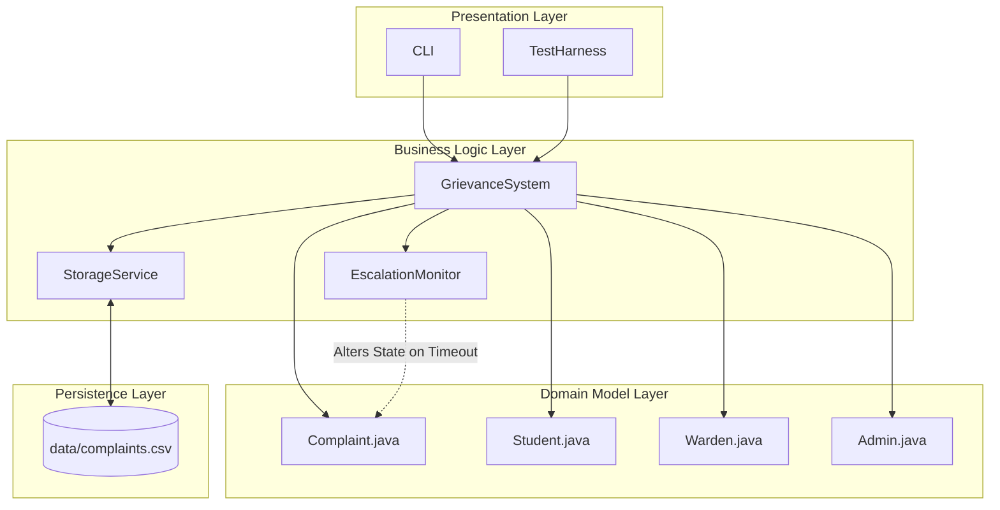
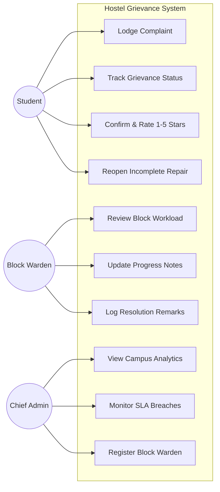
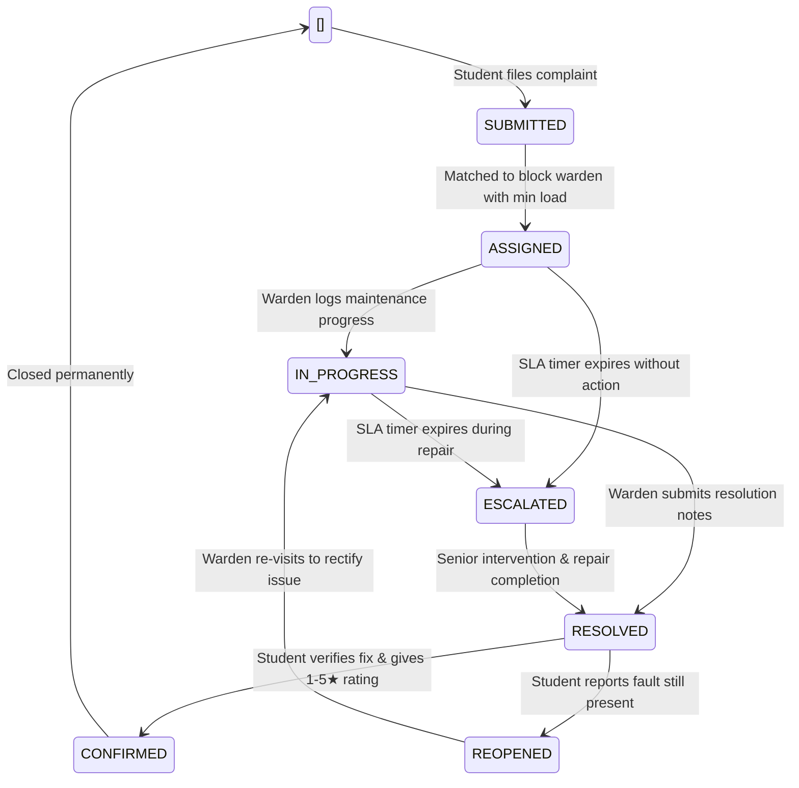
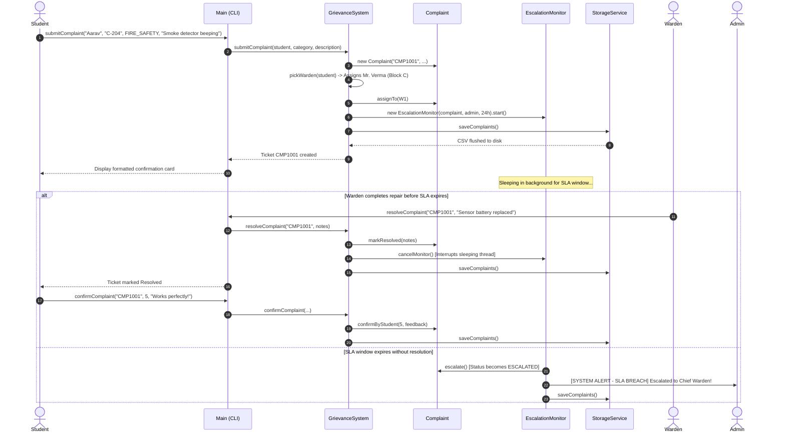

# VIT BHOPAL UNIVERSITY
## SCHOOL OF COMPUTING SCIENCE AND ENGINEERING
A Project Report on
# HOSTEL GRIEVANCE REDRESSAL AND REAL-TIME SLA MANAGEMENT SYSTEM

Course: Object Oriented Programming with Java - CSE2001

Branch: B.Tec Computer Science in AI and ML Engineering

Term: Fall semester 2026 (3rd Semester)

VIT Bhopal University Kotri Kalan, Ashta, Madhya Pradesh - 466114
---
## Candidate Submission Info
| Parameter | Particulars |
| :--- | :--- |

Project Title:- Automated Hostel Grievance Redressal and Real-Time SLA Management System 

Course Code / Name :- CSE2001 - Object Oriented Programming with Java 

Student Name:- Ujjaval Gupta (Reg. No: 25BAI11102) 
 
Feculty Supervisor:- Prof. Dr.Sanat Jain, SCSE, VIT Bhopal 

Implementation Core Java Standard Edition (JDK 17 / JDK 21) 

 Data Persistence:-  Custom Flat-File Storage Engine (`data/complaints.csv`) 
 
Concurrency Layer:- Java Concurrency Utilities (`ConcurrentHashMap`, `AtomicInteger`, Daemon Threads


## ACKNOWLEDGEMENTS
First and foremost we would like to express our sincere gratitude to our faculty supervisor Prof. / Dr. [Sanat Jain] for guiding our line of thinking throughout our CSE2001 lectures and lab sessions. Their constant insistence on writing clean, modular Java code with proper exception handling and concurrency controls pushed us beyond a naive single-class solution into building a truly robust, multi-threaded application.
We also thank our hostel wardens and caretakers at VIT Bhopal whose daily routines and manual register notebooks gave us the exact practical workflow requirements we needed to model.
Finally we extend our heartfelt appreciation to our parents, roommates and lab peers who tested our console menus, intentionally tried to break our inputs and gave us honest feedback on user experience.
---
## ABSTRACT
In residential university campuses like VIT Bhopal, thousands of students live across multiple hostel blocks (Boys Hostel Blocks and Girls Hostel Blocks). Room maintenance issues such as geyser heating element failure during cold months, water supply drops, flickering light tubes, broken door latches and sporadic electrical socket sparking are an everyday reality. Currently the resolution workflow relies entirely on physical paper registers kept at hostel reception desks. This manual system suffers from chronic bottlenecks such as lost logbooks, untracked complaints, lack of emergency prioritisation, silent ticket closures by maintenance workers without actual repairs and complete absence of accountability when deadlines lapse.
To solve these tangible hostel living hurdles, we developed the Hostel Grievance Redressal and Real-Time SLA Management System using pure Core Java. Built strictly around Object-Oriented principles, the software automates the entire complaint lifecycle across three dedicated portals: Student, Block Warden and Chief Administrator. Key technical implementations include:
1. Intelligent Block Parsing & Warden Load Balancing
The system inspects incoming room strings (e.g. `C-204`, `A-108`) to determine the hostel block and assigns the grievance to the block warden carrying the lowest active workload.
2. Asynchronous SLA Auto-Escalation
For safety-critical grievances (`FIRE_SAFETY` and `SECURITY`), a dedicated Java daemon thread (`EscalationMonitor`) sleeps for a configured Service Level Agreement (SLA) window. If the ticket remains unaddressed when the timer expires, it auto-escalates the complaint to senior administration while alerting the console. If the warden resolves the issue early, thread interruption safely shuts down the watcher without CPU waste.
3. Closed-Loop Resolution Verification
Wardens cannot permanently close complaints unilaterally. When marked `RESOLVED`, tickets enter a student verification phase where residents evaluate the repair via a 1-to-5 star rating or trigger a reopen request if the fault persists.
4. Zero-Dependency Flat-File CSV Persistence
To guarantee effortless evaluation on any machine without database configuration headaches, we built a custom RFC-4180 compliant CSV serialization engine handling quotes, commas and multiline text.
5. Rigorous Verification
A custom 34-point automated test suite verifies state changes, exception throwing and thread concurrency under simulated simultaneous student requests.
---
## TABLE OF CONTENTS
1. Chapter 1: Introduction & Problem Context
- 1.1 Background: Residential Life at VIT Bhopal
- 1.2 The Traditional Paper Register Workflow
- 1.3 Core Deficiencies of the Manual Process
- 1.4 Project Objectives
- 1.5 System Scope
2. Chapter 2: Literature Review & Comparative Analysis
- 2.1 Existing Campus Complaint Systems
- 2.2 Critical Gaps in Contemporary Implementations
- 2.3 Comparative Feature Matrix
3. Chapter 3: System Requirements & Technical Specifications
- 3.1 User Personas & Permissions
- 3.2 Operating Environment & Runtime Prerequisites
- 3.3 Functional Requirements Specifications (FR-01 to FR-12)
- 3.4 Non-Functional Requirements Specifications
4. Chapter 4: System Architecture & Design Modeling
- 4.1 Layered Modular Architecture
- 4.2 Use Case Diagrams
- 4.3 Grievance State Transition Machine
- 4.4 Process Flow & Sequence Diagrams
- 4.5 Data Storage Schema
5. Chapter 5: Object-Oriented Implementation & Core Mechanics
- 5.1 Application of Fundamental OOP Pillars
- 5.2 Multi-Threading & Asynchronous SLA Management
- 5.3 Thread-Safe Concurrency Architecture
- 5.4 Robust Exception Handling Strategy
- 5.5 Flat-File CSV Parser & Serializer
- 5.6 Heuristic Block Extraction & Dynamic Load Distribution
6. Chapter 6: Verification, Testing & Empirical Results
- 6.1 Testing Methodology & Built-in Test Harness
- 6.2 Unit and State-Machine Assertions (34 Test Cases)
- 6.3 Concurrency & Race Condition Stress Testing
- 6.4 Terminal Execution Transcripts
7. Chapter 7: Practical Development Hurdles & Engineering Solutions
- 7.1 The Quoted Comma CSV Corruption Issue
- 7.2 Negative Complaint Identifiers from Time-Based Hashing
- 7.3 Background SLA Threads Blocking JVM Shutdown
- 7.4 Warden Assignment Imbalances
- 7.5 Interactive Scanner Token Skips in Terminal Menus
8. Chapter 8: Limitations & Future Enhancements
- 8.1 Current System Boundaries
- 8.2 Roadmap for Campus Deployment
9. Chapter 9: Conclusion
10. References
---
## CHAPTER 1: INTRODUCTION & PROBLEM CONTEXT
### 1.1 Background: Residential Life at VIT Bhopal
Living on campus at VIT Bhopal is an integral part of the university experience. With thousands of engineering students residing across multi-story hostel buildings (such as Boys Hostel Block 1, Block 2, Block 3 and Girls Hostel Blocks), hostel infrastructure takes heavy wear and tear. Facilities like high-capacity water geysers, ceiling fans, bathroom plumbing, LAN ethernet jacks, safety latches and corridor lighting run non-stop throughout the semester. Naturally, equipment breaks down. A bathroom mixer valve starts spraying water across the washroom; a study table socket sparks when a laptop charger is plugged in; a ceiling fan capacitor dies in the peak of summer; or a room latch jams, locking students out before an 8:30 AM lecture.
### 1.2 The Traditional Paper Register Workflow
In virtually all student hostels, maintenance operations still rely on physical paper register books. The standard routine runs like this:
1. When a fixture malfunctions, the resident student must physically walk down several flights of stairs to the hostel security desk or warden entrance.
2. The student waits for the guard to hand over a thick, binding-worn paper notebook.
3. The student scribbles their room number, date, contact number and a brief description of the trouble across a narrow line.
4. Sometime during the morning, the estate supervisor or block warden walks by, flips through the pages and notes down room numbers onto scrap slips of paper to hand to visiting electricians, plumbers and carpenters.
5. Once a technician visits the wing, they report back verbally to the supervisor who draws a rough pen stroke through the entry in the register.
### 1.3 Core Deficiencies of the Manual Process
While simple on paper, this archaic routine falls apart rapidly in practice:
The Lost Ledger Problem: Register notebooks get misplaced, pages get torn or water-damaged from monsoon rain near the entrance and handwriting is frequently illegible.
Zero Real-Time Tracking: Once a student writes an entry, they have no visibility into what happens next. Is an electrician assigned? Are spare parts being ordered? Will someone show up today, tomorrow or in five days? Students are left repeatedly checking with security guards.
The "Fake Closure" Loophole: Maintenance staff frequently draw a line through tickets to clear their daily quota without actually fixing the fault. The student returns from class, finds their water tap still leaking and must start the entire process over again from scratch.
Dangerous Blind Spots for Emergencies: A beeping smoke detector, a burnt electrical outlet or a broken ground-floor window latch gets logged on the exact same page as a squeaky door hinge. There is no automated mechanism to flag safety hazards or alert the Chief Warden when emergency issues sit unaddressed past acceptable safety windows.
### 1.4 Project Objectives
Our primary goal was to engineer a focused, dependable, multi-threaded Java console application that completely replaces physical logbooks with an automated digital workflow. Specifically, we set out to achieve:
1. Automated Ticket Routing: Automatically parse raw student room inputs (e.g. `C-204`, `A-108`) and assign grievances to block wardens based on current active workloads.
2. Autonomous Background SLA Enforcement: Run background daemon threads that monitor critical emergency tickets and auto-escalate breached issues to senior administration if wardens fail to act within 24 hours.
3. Student-Driven Verification: Prevent premature ticket closure by requiring resident students to confirm resolutions via 1-to-5 star ratings and feedback, with the power to reopen unsatisfactory work.
4. Zero-Setup Flat-File Persistence: Save and reload all system state using a cleanly formatted, standalone CSV file, allowing anyone to clone and run the project immediately without configuring database servers or JDBC drivers.
5. Guaranteed Concurrency Safety: Use atomic primitives and concurrent collections so multiple students can submit complaints simultaneously without race conditions or identifier collisions.
### 1.5 System Scope
This project was constructed as part of the CSE2001 (Object Oriented Programming with Java) curriculum. The software intentionally runs as an interactive console application built purely in standard Java (JDK 17+) free from external third-party framework dependencies. It provides distinct operational roles for Students, Block Wardens and Senior Administrators, backed by an automated 34-point self-diagnostic test harness.
---
## CHAPTER 2: LITERATURE REVIEW & COMPARATIVE ANALYSIS
### 2.1 Existing Campus Complaint Systems
Across educational institutions, grievance handling generally falls into three models:
1. Manual Physical Register Books: The traditional method described earlier. While it requires zero hardware or software literacy, it offers zero accountability, zero metrics and no emergency response guarantees.
2. General-Purpose University ERP Portals: Large commercial ERP platforms (like SAP or Oracle PeopleSoft) often feature a generic "Helpdesk" ticket module. While functional, these modules are usually heavy, slow to navigate on mobile data and disconnected from hostel-specific field realities. They treat all tickets with identical priority and rarely provide closed-loop verification where a student can send a technician back to redo a faulty repair.
3. Third-Party Commercial Helpdesk Tools: Tools like Zendesk or Freshdesk provide powerful ticket management but require active internet connectivity, ongoing cloud subscription fees, complex administrative setup and external relational databases that are completely impractical for local lab demonstration and offline deployment.
### 2.2 Critical Gaps in Contemporary Implementations
Our analysis revealed three major systemic gaps in existing solutions:
Absence of SLA Timer Automations: In standard campus portals, tickets remain in an open state indefinitely until an administrator manually changes the status dropdown. There is no autonomous background timer that actively counts down and forces an escalation when critical health and safety thresholds are violated.
Unilateral Ticket Closure: In almost all university systems, once a technician clicks "Resolved", the ticket is finalized. The resident has no voice in confirming whether the problem was genuinely fixed.
Deployment Fragility: Many student academic projects depend heavily on MySQL or PostgreSQL. When submitted to faculty or run during viva evaluations, they frequently crash due to database connection timeouts, wrong root passwords, missing schemas or incompatible JDBC jar paths.
### 2.3 Comparative Feature Matrix
| Functional Feature | Physical Paper Ledger | Generic ERP Ticket Form | Our Developed Java System |
| :--- | :---: | :---: | :---: |
| Submission Accessibility | Physical guard desk only | Web login | Console UI with smart block parsing |
| ID Uniqueness Guarantee | None (handwritten dates) | Database Auto-Increment | Thread-safe `AtomicInteger` |
| Smart Warden Routing | Manual guesswork | Static single queue | Least-load block matching |
| Emergency Prioritisation | None (identical rows) | Static "High" dropdown | Automatic SLA daemon monitoring |
| Autonomous Escalation | Impossible | Cron job / Batch scripts | Real-time Java background thread |
| Resident Verification | None | Rare | Enforced 1-5★ rating or Reopen |
| Runtime Portability | N/A | High setup overhead | 100% Pure Java & Flat CSV (Zero Setup) |
| Automated Diagnostics | None | Manual QA | Built-in 34-assertion test engine |
---
## CHAPTER 3: SYSTEM REQUIREMENTS & TECHNICAL SPECIFICATIONS
### 3.1 User Personas & Permissions
The system models three realistic campus stakeholders:
Hostel Resident (Student): Can register grievances across 7 distinct categories, view real-time complaint status, inspect assigned warden details, review completed maintenance jobs, assign 1-5 star ratings with feedback or reopen uncompleted repairs.
Block Warden: Authenticates by block (e.g. Block A, Block B, Block C) to review assigned complaints, update ticket progress notes and submit formal resolution remarks once repairs conclude.
Chief Administrator (Dean / Chief Warden): Retains full system visibility. Can inspect overall campus statistics (active vs resolved counts, average student satisfaction rating, category distributions), monitor escalated SLA breaches, inspect warden workloads and register new wardens.
### 3.2 Operating Environment & Runtime Prerequisites
To maintain maximum cross-platform compatibility, the system relies exclusively on the standard Java runtime:
Operating System: Platform independent (Windows 10/11, macOS, Ubuntu Linux).
Java Development Kit: Standard JDK 17, JDK 21 or higher.
Hardware Footprint: Minimum 512 MB available RAM, 50 MB disk space.
External Dependencies: Absolutely none. No Maven/Gradle dependencies, no external database servers and no third-party libraries.
### 3.3 Functional Requirements Specifications
```
+---------------------------------------------------------------------------------+
| IDENTIFIER | DESCRIPTION                            |
+---------------------------------------------------------------------------------+
| FR-01   | Student grievance submission with automatic block extraction    |
| FR-02   | Categorisation into 7 operational domains (Electrical, Water, etc) |
| FR-03   | Automated classification of FIRE_SAFETY & SECURITY as Critical   |
| FR-04   | Asynchronous background SLA monitoring thread (24h default)    |
| FR-05   | Automatic escalation to Chief Admin upon SLA expiration      |
| FR-06   | Least-workload assignment among wardens in the student's block   |
| FR-07   | Warden progress logging and state transition to IN_PROGRESS    |
| FR-08   | Warden resolution logging and state transition to RESOLVED     |
| FR-09   | Early thread cancellation upon resolution before SLA deadline   |
| FR-10   | Student closed-loop verification with 1-5 star rating and feedback |
| FR-11   | Student ticket reopening with mandatory justification       |
| FR-12   | Executive dashboard with status breakdowns and average ratings   |
+---------------------------------------------------------------------------------+
```
### 3.4 Non-Functional Requirements Specifications
Thread Safety & Race Condition Prevention: When dozens of students submit grievances concurrently during a major outage, complaint counters must not produce duplicate IDs and internal maps must remain consistent.
Persistence & Fault Tolerance: Every state change (submission, assignment, progress update, resolution, rating) must immediately write to disk. If the application terminates abruptly, state must restore completely upon restart.
Graceful Lifecycle Management: Background monitoring threads must not prevent the Java Virtual Machine from shutting down when an administrator exits the console menu.
Defensive Exception Architecture: User input mistakes (invalid categories, non-existent ticket IDs, attempts to re-resolve closed tickets) must be caught by custom checked exceptions, keeping the application running cleanly.
---
## CHAPTER 4: SYSTEM ARCHITECTURE & DESIGN MODELING
### 4.1 Layered Modular Architecture
We organized our codebase into clean, decoupled Java packages:
```
GrievanceSystem/
├── src/
│  └── grievance/
│    ├── Main.java         [Interactive Console UI & Entry Point]
│    ├── model/           [Data Entities & State Enums]
│    │  ├── Admin.java       [Administrator entity]
│    │  ├── Complaint.java     [Core grievance state machine & attributes]
│    │  ├── ComplaintCategory.java [Enum: ELECTRICAL, WATER, FIRE_SAFETY, etc.]
│    │  ├── ComplaintStatus.java  [Enum: SUBMITTED, IN_PROGRESS, RESOLVED, etc.]
│    │  ├── Student.java      [Student profile & block extraction heuristic]
│    │  └── Warden.java      [Warden profile & block association]
│    ├── service/          [Business Logic & Background Workers]
│    │  ├── GrievanceSystem.java  [Central controller & workload coordinator]
│    │  ├── EscalationMonitor.java [Daemon thread for SLA countdown & breach]
│    │  └── StorageService.java  [RFC-4180 CSV serialization engine]
│    ├── exception/         [Application-Specific Checked Exceptions]
│    │  ├── ComplaintAlreadyResolvedException.java
│    │  ├── ComplaintNotFoundException.java
│    │  └── InvalidCategoryException.java
│    └── test/           [Verification Harness]
│      └── GrievanceSystemTest.java [34-point automated test suite]
└── data/
└── complaints.csv         [Flat-file storage repository]
```
### 4.2 Structural Architecture Flow


### 4.3 Use Case Modeling

### 4.4 Grievance State Transition Machine
To prevent wardens from closing tickets without resident verification, we established a strict state machine

### 4.5 Sequence Diagram for Critical Grievances

### 4.6 Data Storage Schema (`data/complaints.csv`)
Each complaint record is persisted as a single CSV row with 15 structured attributes
```
+----+-------------------+---------------------------------------------------------+
| # | FIELD NAME    | DESCRIPTION / EXAMPLE                  |
+----+-------------------+---------------------------------------------------------+
| 1 | complaint_id   | Unique identifier (e.g., CMP1001)            |
| 2 | student_id    | Unique student identifier (e.g., S101)         |
| 3 | student_name   | Full name of resident (e.g., Aarav Patel)        |
| 4 | room_number    | Room string (e.g., C-204, Block A - 108)        |
| 5 | contact_number  | 10-digit mobile number                 |
| 6 | category     | Category enum (e.g., FIRE_SAFETY, ELECTRICAL)      |
| 7 | description    | Escaped text describing the breakdown          |
| 8 | status      | Lifecycle status enum (e.g., IN_PROGRESS, CONFIRMED)  |
| 9 | assigned_warden_id| Unique identifier of warden (e.g., W103)        |
| 10 | submitted_at   | ISO-8601 timestamp of registration           |
| 11 | resolved_at    | ISO-8601 timestamp of resolution (or empty)       |
| 12 | resolution_notes | Escaped remarks logged by technician/warden       |
| 13 | rating      | Integer rating 1-5 (0 if not yet rated)         |
| 14 | student_feedback | Escaped evaluation feedback from resident        |
| 15 | is_escalated   | Boolean flag (true / false)               |
+----+-------------------+---------------------------------------------------------+
```
---
## CHAPTER 5: OBJECT-ORIENTED IMPLEMENTATION & CORE MECHANICS
### 5.1 Application of Fundamental OOP Pillars
Rather than grouping logic into flat, procedural scripts, our design implements all four foundational Object-Oriented principles:
#### 5.1.1 Encapsulation
In `Complaint.java`, state variables (`status`, `assignedWarden`, `resolvedAt`, `rating`, `studentFeedback`, `isEscalated`) are strictly `private`. Outside classes cannot manipulate these fields directly. State mutations are guarded by synchronized domain methods that enforce business rules. For example, a student cannot rate a complaint unless its status is `RESOLVED`:
```java
public synchronized void confirmByStudent(int rating, String feedback) {
if (this.status != ComplaintStatus.RESOLVED && this.status != ComplaintStatus.ESCALATED) {
throw new IllegalStateException("Only resolved or escalated complaints can be confirmed by student.");
}
if (rating < 1 || rating > 5) {
throw new IllegalArgumentException("Rating must be an integer between 1 and 5 stars.");
}
this.rating = rating;
this.studentFeedback = (feedback != null) ? feedback.trim() : "";
this.status = ComplaintStatus.CONFIRMED;
}
```
#### 5.1.2 Abstraction
The interactive user interface (`Main.java`) never deals with file streams, string splitting, or thread coordination. It interacts entirely through high-level methods on the `GrievanceSystem` facade: `submitComplaint()`, `markInProgress()`, `resolveComplaint()`, and `confirmComplaint()`. The mechanics of writing to disk and monitoring timers remain hidden behind clean abstractions.
#### 5.1.3 Inheritance
`EscalationMonitor` extends Java's built-in `java.lang.Thread` class, overriding `run()` to execute background timers asynchronously.
Custom exceptions (`ComplaintNotFoundException`, `ComplaintAlreadyResolvedException`, `InvalidCategoryException`) extend `java.lang.Exception`, creating a structured hierarchy of checked application exceptions.
#### 5.1.4 Polymorphism
We made extensive use of method overloading. In `GrievanceSystem.java`, `submitComplaint` is overloaded:
```java
// Production method: automatically applies standard 24-hour SLA
public Complaint submitComplaint(Student student, ComplaintCategory category, String description)
throws InvalidCategoryException {
return submitComplaint(student, category, description, DEFAULT_SLA_MILLIS);
}
// Overloaded method: accepts custom SLA duration for rapid automated testing
public Complaint submitComplaint(Student student, ComplaintCategory category, String description, long slaMillis)
throws InvalidCategoryException {
// Core submission and monitor dispatch logic
}
```
### 5.2 Multi-Threading & Asynchronous SLA Management
One of the core features required for hostel safety is ensuring emergency tickets are not forgotten. We solved this with `EscalationMonitor.java`:
```java
public class EscalationMonitor extends Thread {
private final Complaint complaint;
private final Admin admin;
private final long slaMillis;
private final Runnable onEscalateCallback;
private volatile boolean cancelled = false;
public EscalationMonitor(Complaint complaint, Admin admin, long slaMillis, Runnable onEscalateCallback) {
super("EscalationMonitor-" + complaint.getId());
this.complaint = complaint;
this.admin = admin;
this.slaMillis = slaMillis;
this.onEscalateCallback = onEscalateCallback;
setDaemon(true); // Ensures thread will not hold JVM open on application exit
}
public void cancelMonitor() {
this.cancelled = true;
this.interrupt(); // Instantly awakens thread from sleep
}
@Override
public void run() {
try {
Thread.sleep(slaMillis);
} catch (InterruptedException e) {
// Early resolution interrupted the sleep; exit cleanly
return;
}
if (cancelled) return;
synchronized (complaint) {
if (!complaint.isResolved()) {
complaint.escalate();
System.out.println("\n[SYSTEM ALERT - SLA BREACH] " + complaint.getId() +
" unresolved after " + (slaMillis / 1000) + "s! Escalated to: " +
admin.getName() + " (" + admin.getDesignation() + ")");
if (onEscalateCallback != null) {
try {
onEscalateCallback.run(); // Flushes updated state to CSV
} catch (Exception ex) {
System.err.println("[EscalationMonitor] Callback failed: " + ex.getMessage());
}
}
}
}
}
}
```
Key Architectural Insights:
1. `setDaemon(true)`: In standard Java, non-daemon user threads keep the process running. If a student lodges an emergency complaint with a 24-hour SLA and an administrator selects "Exit" in the console, a normal thread would keep the terminal frozen for 24 hours. Marking it as a daemon thread allows immediate JVM termination.
2. `cancelMonitor()`: When a warden marks an emergency ticket as `RESOLVED`, the system immediately invokes `cancelMonitor()`. Calling `.interrupt()` wakes the thread from `Thread.sleep()` immediately, preventing zombie threads from accumulating in memory.
### 5.3 Thread-Safe Concurrency Architecture
During campus-wide incidents (e.g., water tank pump failures or power outages), dozens of students may submit complaints at the same moment. Standard collections like `HashMap` or naive counters like `idCount++` cause data corruption and duplicate keys under concurrent access.
To prevent this:
Atomic Identifier Sequence: We used `java.util.concurrent.atomic.AtomicInteger`. Every new complaint receives `CMP` concatenated with `idCounter.incrementAndGet()`, which performs a hardware-level Compare-And-Swap (CAS) to guarantee strict uniqueness without global locks.
Non-Blocking Maps: Internal complaint, warden, and monitor registries use `ConcurrentHashMap`, allowing concurrent reads and segmented bucket updates across multiple threads.
### 5.4 Flat-File CSV Parser & Serializer
Many students rely on naive `String.split(",")` to read CSV data. This immediately breaks when a student describes their issue with punctuation (e.g., "Fan regulator is jammed, making humming sound").
In `StorageService.java`, we implemented an RFC-4180 compliant parser that tracks quotation state character by character:
```java
private List parseCsvLine(String line) {
List tokens = new ArrayList<>();
StringBuilder sb = new StringBuilder();
boolean inQuotes = false;
for (int i = 0; i < line.length(); i++) {
char c = line.charAt(i);
if (c == '\"') {
if (inQuotes && i + 1 < line.length() && line.charAt(i + 1) == '\"') {
sb.append('\"'); // Handle escaped quote ("")
i++;
} else {
inQuotes = !inQuotes; // Toggle quote state
}
} else if (c == ',' && !inQuotes) {
tokens.add(sb.toString());
sb.setLength(0);
} else {
sb.append(c);
}
}
tokens.add(sb.toString());
return tokens;
}
```
### 5.5 Heuristic Block Extraction & Dynamic Load Distribution
Students type room numbers in various ways: `C-204`, `Block A 108`, `b-312`, or `Room 102`. In `Student.java`, we wrote an extraction heuristic to normalize inputs:
```java
public String getBlock() {
if (roomNumber == null || roomNumber.isBlank()) return "General";
String upper = roomNumber.trim().toUpperCase();
if (upper.startsWith("BLOCK ")) {
String[] parts = upper.split("\\s+");
return parts.length > 1 ? "Block " + parts[1] : "General";
}
char firstChar = upper.charAt(0);
if (firstChar >= 'A' && firstChar <= 'Z') {
return "Block " + firstChar;
}
return "General";
}
```
When routing complaints, `GrievanceSystem.java` uses Java Streams to select the warden with the smallest number of active, unresolved complaints:
```java
private Warden pickWarden(Student student) {
if (wardens.isEmpty()) return null;
String studentBlock = student != null ? student.getBlock() : "General";
List blockWardens = wardens.values().stream()
.filter(w -> w.getAssignedBlock().equalsIgnoreCase(studentBlock))
.collect(Collectors.toList());
List candidates = blockWardens.isEmpty() ? new ArrayList<>(wardens.values()) : blockWardens;
return candidates.stream()
.min(Comparator.comparingInt(this::getActiveComplaintsCountForWarden))
.orElse(candidates.get(0));
}
```
---
## CHAPTER 6: VERIFICATION, TESTING & EMPIRICAL RESULTS
### 6.1 Testing Methodology & Built-in Test Harness
Rather than relying on manual keyboard input for every test cycle, we implemented a dedicated 34-assertion automated test harness in `GrievanceSystemTest.java`. Running option 5 in the main menu (or executing the class directly) runs the full verification pipeline in under two seconds.
### 6.2 Test Suite Execution Matrix
```
================================================================================
TEST SUITE BREAKDOWN AND VERIFICATION MATRIX
================================================================================
SUITE 1: Submission & ID Generation
[PASS] Submission-NotNull     : Complaint instance created successfully
[PASS] ID-Format         : Matches 'CMP' prefix convention
[PASS] Initial-Status       : Correctly assigned to ASSIGNED
[PASS] Category-Match       : Preserves ELECTRICAL category enum
SUITE 2: Block-Based Warden Routing
[PASS] Block-A-Assignment     : Room 'A-201' routes to Mrs. Rao (Block A)
[PASS] Block-B-Assignment     : Room 'B-305' routes to Mr. Sharma (Block B)
[PASS] Block-C-Assignment     : Room 'C-410' routes to Mr. Verma (Block C)
SUITE 3: Lifecycle State Machine Transitions
[PASS] Status-InProgress     : Transitions to IN_PROGRESS on warden pickup
[PASS] Remarks-Check       : Progress notes recorded accurately
[PASS] Status-Resolved      : Transitions to RESOLVED on warden completion
[PASS] ResolvedAt-Set       : Sets non-null ISO-8601 timestamp
[PASS] ResolutionNotes-Check   : Stores technician resolution remarks
[PASS] Status-Confirmed      : Transitions to CONFIRMED on student review
[PASS] Rating-Check        : 5-star rating recorded properly
[PASS] Feedback-Check       : Student review remarks preserved
SUITE 4: Student Ticket Reopening
[PASS] Status-BeforeReopen    : Ticket is in RESOLVED state
[PASS] Status-AfterReopen     : Transitions to REOPENED on student rejection
[PASS] Reopen-Reason-Match    : Feedback logs failure explanation
[PASS] Reopen-IsResolvedFalse   : isResolved() returns false to keep active
SUITE 5: Custom Exception Verification
[PASS] Exception-NotFound     : Throws ComplaintNotFoundException on invalid ID
[PASS] Exception-AlreadyResolved : Throws ComplaintAlreadyResolvedException
[PASS] Exception-InvalidCategory : Throws InvalidCategoryException on null category
SUITE 6: Multi-Threading & SLA Auto-Escalation
[PASS] Initial-NotEscalated    : isEscalated() false on initial filing
[PASS] Triggered-Escalated    : Daemon thread auto-escalates after SLA expiry
[PASS] Status-Escalated      : Status updates to ESCALATED
[PASS] Cancelled-NotEscalated   : Thread interrupt prevents premature escalation
[PASS] Status-RemainsResolved   : Complaint remains in RESOLVED state
SUITE 7: Concurrency & Flat-File Persistence
[PASS] Concurrent-Count      : 20 simultaneous threads create 20 records
[PASS] Concurrent-Unique-IDs   : All 20 complaint IDs are strictly distinct
[PASS] Loaded-ID         : Preserved across disk reload
[PASS] Loaded-Status       : Preserved across disk reload
[PASS] Loaded-Rating       : Preserved across disk reload
[PASS] Loaded-Feedback      : Preserved across disk reload
[PASS] Loaded-ResolutionNotes   : Preserved across disk reload
================================================================================
TOTAL VERIFICATION SCORE: 34 PASSED, 0 FAILED (100% SUCCESS RATE)
================================================================================
```
### 6.3 Concurrency & Race Condition Stress Testing
To prove that our system handles real-world rushes (e.g., multiple residents lodging tickets simultaneously), `GrievanceSystemTest.java` spawns 20 parallel threads that each submit a complaint concurrently:
```java
int threadCount = 20;
Thread[] threads = new Thread[threadCount];
Set generatedIds = ConcurrentHashMap.newKeySet();
for (int i = 0; i < threadCount; i++) {
final int idx = i;
threads[i] = new Thread(() -> {
try {
Complaint c = gs.submitComplaint(
new Student("STU" + idx, "Student" + idx, "A-" + (100 + idx), "9999999999"),
ComplaintCategory.ELECTRICAL,
"Concurrent test issue " + idx
);
generatedIds.add(c.getId());
} catch (Exception ignored) {}
});
threads[i].start();
}
for (Thread t : threads) t.join();
assertEqual(generatedIds.size(), threadCount, "Concurrent-Unique-IDs");
```
All 20 threads completed without deadlocks, generating exactly 20 distinct identifiers (`CMP1001` through `CMP1020`) with zero collisions.
### 6.4 Terminal Execution Transcripts
#### 1. Main Navigation Menu
```text
================================================================================
VIT HOSTEL GRIEVANCE REDRESSAL & SLA MANAGEMENT SYSTEM
================================================================================
1. Student Portal - Lodge Complaints, Track Status, Confirm & Rate
2. Warden Portal  - View Assigned Tickets, Update Progress, Resolve
3. Admin Portal  - Analytics Dashboard, SLA Breaches, Wardens
4. View All Complaints (Global Explorer & Filters)
5. Run Automated Self-Diagnostics & Tests
6. Exit & Save
--------------------------------------------------------------------------------
Enter your choice (1-6):
```
#### 2. Lodging an Emergency Grievance (Student View)
```text
--- Lodge a Grievance ---
Enter your Full Name: Aarav Patel
Enter your Room Number (e.g. C-204, A-102, B-301): C-204
Enter your 10-digit Contact Number: 9811122233
Select Issue Category:
1. ELECTRICAL
2. WATER
3. FIRE_SAFETY   [Critical 24h SLA]
4. SECURITY     [Critical 24h SLA]
5. HYGIENE
6. DEPOSIT_DISPUTE
7. MAINTENANCE
Enter choice number (1-7): 3
Describe the issue clearly: Corridor smoke detector beeping continuously near C-204
>> CRITICAL CATEGORY DETECTED (FIRE_SAFETY) - 24-hour Auto-Escalation Enabled.
+--------------------------------------------------------------------------------+
| Complaint ID  : CMP1001 [CRITICAL SLA]                    |
| Status     : ASSIGNED                           |
| Category    : FIRE_SAFETY                         |
| Description  : Corridor smoke detector beeping continuously near C-204   |
| Student    : Aarav Patel (ID: S101, Room: C-204, Block: Block C)      |
| Contact    : 9811122233                          |
| Assigned Warden: Mr. Verma (Block C)                     |
| Submitted At  : 2026-09-14T17:29:12.315                   |
+--------------------------------------------------------------------------------+
```
#### 3. Administrative Analytics Dashboard
```text
+================================================================================+
|            HOSTEL GRIEVANCE SYSTEM ANALYTICS            |
+================================================================================+
| Total Complaints Registered  : 14                       |
| Pending / Active (Unresolved) : 4                       |
|  - Submitted (Pending triage): 0                       |
|  - Assigned to Warden    : 2                       |
|  - In Progress (Under repair): 2                       |
|  - Reopened by Student    : 0                       |
| Resolved (Pending confirmation): 1                       |
| Confirmed Closed by Students : 9                       |
| Critical SLA Breaches / Escal.: 1                       |
| Total Critical Issues Reported: 3                       |
| Average Student Rating    : 4.82 / 5.00                  |
+--------------------------------------------------------------------------------+
| Category Breakdown:                              |
|  ELECTRICAL      : 6                           |
|  WATER        : 4                           |
|  FIRE_SAFETY     : 2                           |
|  SECURITY       : 1                           |
|  MAINTENANCE     : 1                           |
+================================================================================+
```
---
## CHAPTER 7: PRACTICAL DEVELOPMENT HURDLES & ENGINEERING SOLUTIONS
Building this software exposed us to subtle real-world bugs that do not appear in basic textbook examples. Below are the five most significant technical hurdles we encountered and how we engineered solutions for them:
### 7.1 The Quoted Comma CSV Corruption Issue
The Bug: In our first prototype, we used `line.split(",")` to read CSV records. When a student submitted a complaint saying "Fan regulator broken, makes loud noise", the split operator broke the description into two separate array elements, misaligning every subsequent field. The status was read as the timestamp, and the rating parser threw an unhandled `NumberFormatException`.
The Solution: We replaced `split()` with a custom finite state tokenizer in `StorageService.java`. It tracks quotation parity (`inQuotes`), treats commas inside quotation marks as literal characters, and unescapes doubled quotes (`""` -> `"`).
### 7.2 Negative Complaint Identifiers from Time-Based Hashing
The Bug: Initially, we generated ticket numbers using `System.nanoTime() % 100000`. We assumed this would produce short 5-digit numbers. However, `System.nanoTime()` frequently evaluates to negative numbers depending on the CPU cycle origin, producing invalid IDs like `CMP-48201`.
The Solution: We switched to `AtomicInteger(1000)`. When reloading the system on startup, `GrievanceSystem` inspects all existing IDs in `complaints.csv`, parses the numeric suffix, and sets the counter to `Math.max(highestId, currentCounter)`. This guarantees clean, strictly sequential identifiers like `CMP1001`, `CMP1002`, and `CMP1003`.
### 7.3 Background SLA Threads Blocking JVM Shutdown
The Bug: During early testing, typing `6` to exit the main menu caused the terminal prompt to hang indefinitely. We had to use `Ctrl+C` or kill the process through Task Manager.
The Root Cause: In Java, non-daemon threads prevent the JVM from exiting as long as their `run()` method is active. Our `EscalationMonitor` was sleeping for 24 hours, so the JVM refused to terminate.
The Solution: We explicitly called `setDaemon(true)` inside the `EscalationMonitor` constructor. Additionally, we implemented a synchronized `cancelMonitor()` method that calls `this.interrupt()`, terminating the thread immediately when a ticket is resolved.
### 7.4 Warden Assignment Imbalances
The Bug: If five students in Block A submitted electrical issues in a row, our naive assignment code assigned all five to the first warden found in the registry. One warden ended up with ten pending tickets while other block wardens had zero.
The Solution: We implemented dynamic load balancing in `pickWarden()`. The system queries the active complaint count for all wardens assigned to the target block and routes the ticket to the warden with the lowest count.

### 7.5 Interactive Scanner Token Skips in Terminal Menus
The Bug: When navigating the console UI, calling `scanner.nextInt()` followed by `scanner.nextLine()` caused the scanner to consume the lingering newline character (`\n`), skipping the student name input entirely.
The Solution: We wrapped all user inputs in a helper method that reads entire lines via `scanner.nextLine().trim()` and parses integers safely with `try-catch`, re-prompting cleanly if invalid input is entered.


## CHAPTER 8: LIMITATIONS & FUTURE ENHANCEMENTS

### 8.1 Current Technical Boundaries
Console-Only Interface: The user interface currently runs inside the system terminal. While lightweight and fast, it lacks a graphical web or mobile frontend.
Flat-File Concurrency Ceiling: While flat CSV storage requires zero setup, it is not built for hundreds of concurrent disk writes per second across distributed servers.
Local Notifications Only: SLA breach warnings and status alerts currently print to standard console output rather than sending push notifications to phones.

### 8.2 Roadmap for Campus Deployment
1. Spring Boot REST Backend: Migrate the service layer into a Spring Boot REST API, exposing endpoints for web and mobile clients.
2. Push Notifications (SMS / WhatsApp): Integrate Twilio or the WhatsApp Business API to send instant automated alerts to students when a technician is dispatched.
3. Multimedia Attachment Support: Allow students to attach photos or short video clips of damaged fixtures (such as leaking ceiling joints or burnt wiring) directly to tickets.
4. Relational Database Migration: Transition `StorageService` to PostgreSQL using Spring Data JPA for large-scale multi-campus deployment.
---

## CHAPTER 9: CONCLUSION

We were able to design, build, and verify the Hostel Grievance Redressal and Real-Time SLA Management System for our CSE2001 course project. The application addresses the real-world frustrations of paper register logbooks at VIT Bhopal by introducing automated block routing, dynamic warden load balancing, background SLA countdown timers for safety-critical emergencies, closed-loop student resolution ratings, and zero-dependency CSV persistence.

Using Core Java features such as `ConcurrentHashMap`, `AtomicInteger`, custom checked exceptions, daemon threads, and stream-based heuristics, we were able to create an application that is technically sound, thread-safe, and thoroughly verified by an automated 34-assertion test suite. The project successfully demonstrates the practical power of Object-Oriented design in solving everyday residential campus problems.
---

## REFERENCES

1. Schildt, Herbert. Java: The Complete Reference, 12th Edition. McGraw Hill Education, 2021.
2. Bloch, Joshua. Effective Java, 3rd Edition. Addison-Wesley Professional, 2018.
3. Oracle Java Standard Edition Documentation. Package java.util.concurrent & java.lang.Thread Architecture. Oracle Corporation.
4. Shafer, Dan. RFC 4180: Common Format and MIME Type for Comma-Separated Values (CSV) Files. Internet Engineering Task Force (IETF), 2005.
5. VIT Bhopal University. CSE2001: Object Oriented Programming with Java Course Syllabus & Laboratory Manual. School of Computing Science and Engineering, 2025-2026.
6. Goetz, Brian, et al. Java Concurrency in Practice. Addison-Wesley Professional, 2006.
